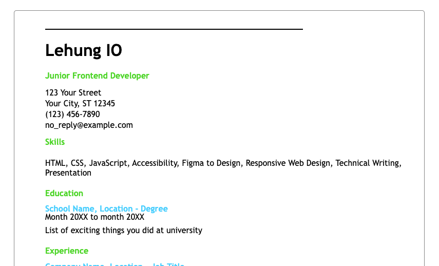

# Hot Roadmap Projects

This repository contains front-end projects built following the [roadmap.sh](https://roadmap.sh/) front-end developer path.

## Projects List

- [Single Page CV](https://lehungio.github.io/hot-roadmap/projects/frontend/single-page-cv/index.html) - [source](https://roadmap.sh/projects/single-page-cv)
- [Basic HTML Website](https://lehungio.github.io/hot-roadmap/projects/frontend/basic-html-website/index.html) - source](https://roadmap.sh/projects/basic-html-website)
<!-- 
- [Personal Portfolio](https://roadmap.sh/projects/portfolio-website)
- [Changelog Component](https://roadmap.sh/projects/changelog-component)
- [Testimonial Cards](https://roadmap.sh/projects/testimonial-cards)
- [Datepicker UI](https://roadmap.sh/projects/datepicker-ui)
- [Accessible Form UI](https://roadmap.sh/projects/accessible-form-ui)
- [Image Grid Layout](https://roadmap.sh/projects/image-grid)
- [Tooltip UI](https://roadmap.sh/projects/tooltip-ui)
- [Simple Tabs](https://roadmap.sh/projects/simple-tabs)
- [Cookie Consent](https://roadmap.sh/projects/cookie-consent)
- [Restricted Textarea](https://roadmap.sh/projects/restricted-textarea)
- [Accordion UI](https://roadmap.sh/projects/accordion)
- [Custom Dropdown](https://roadmap.sh/projects/custom-dropdown)
- [Task Tracker](https://roadmap.sh/projects/task-tracker-js)
- [GitHub Random Repo](https://roadmap.sh/projects/github-random-repo)
- [Reddit Client](https://roadmap.sh/projects/reddit-client)
- [Temperature Converter](https://roadmap.sh/projects/temperature-converter) 
-->

## Project Previews

Click any of the images below to view the README and live demo for each project.

  
    

